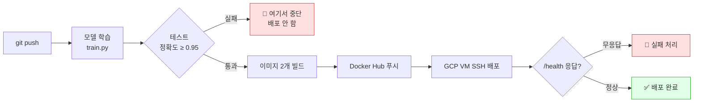
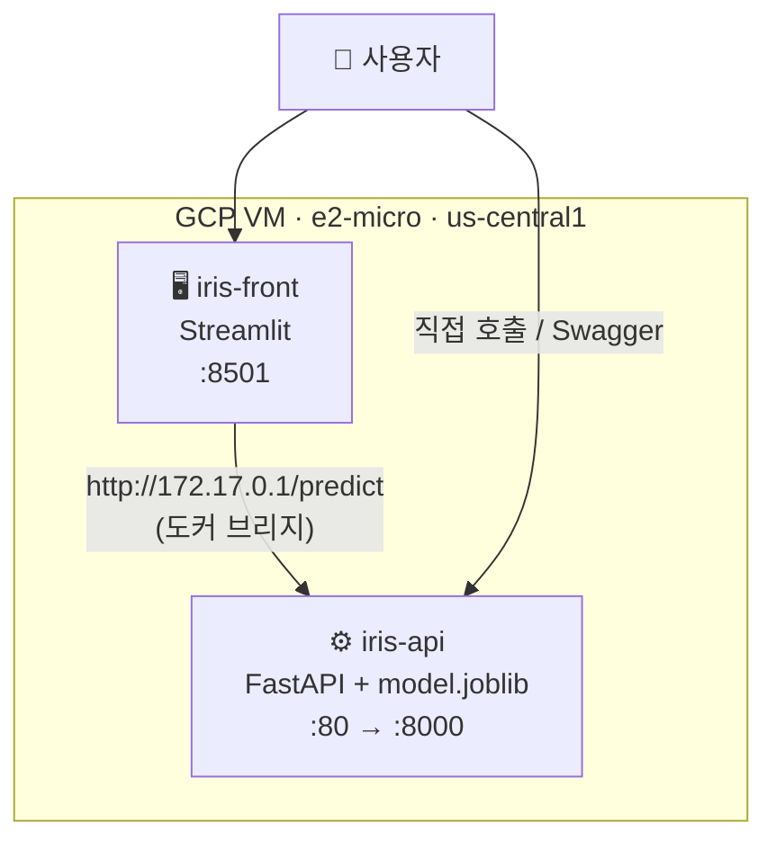

<div align="center">

# 🌸 Iris Classifier — MLOps Serving

**붓꽃 분류 모델을 FastAPI로 서빙하고, `git push` 한 번으로 학습 → 테스트 → 이미지 빌드 → GCP 배포까지 자동으로 굴리는 프로젝트**

[](https://github.com/soya914/mlops_serving/actions/workflows/main.yml)
[](https://hub.docker.com/r/soya14/iris-classifier)
[](https://www.python.org/)
[](https://fastapi.tiangolo.com/)
[](https://streamlit.io/)

</div>

---

## 무엇을 하나요

`main` 브랜치에 푸시하면 사람 손 없이 여기까지 갑니다.



핵심은 **어느 단계든 깨지면 그 앞에서 멈춘다**는 것입니다. 정확도가 떨어진 모델이나 빌드가 깨진 이미지가 운영 서버까지 흘러가지 않습니다.

## 구성

한 대의 GCP VM(e2-micro, 무료 등급) 안에 컨테이너 2개가 돕니다.



프론트엔드는 백엔드를 **외부 IP가 아닌 도커 브리지 게이트웨이**로 부릅니다. VM을 껐다 켜서 외부 IP가 바뀌어도 안 깨지게 하기 위해서입니다.

## API

베이스 URL: `http://<VM 외부 IP>` — **`https` 아닙니다**

| 메서드 | 경로 | 요청 | 응답 |
|:---|:---|:---|:---|
| `GET` | `/` | — | `{"message": "Iris Classifier API is running"}` |
| `GET` | `/health` | — | `{"status": "ok"}` |
| `GET` | `/docs` | — | Swagger UI |
| `POST` | `/predict` | `{"data": [5.1, 3.5, 1.4, 0.2]}` | `{"class_index": 0, "class_name": "setosa"}` |

`data`는 `[꽃받침 길이, 꽃받침 너비, 꽃잎 길이, 꽃잎 너비]` 순서의 실수 4개입니다.

```bash
curl -X POST http://<VM IP>/predict \
  -H "Content-Type: application/json" \
  -d '{"data":[6.7,3.0,5.2,2.3]}'
# → {"class_index":2,"class_name":"virginica"}
```

## 로컬에서 돌려보기

```bash
pip install -r requirements.txt -r requirements-dev.txt
python train.py          # model.joblib 생성
pytest                   # 테스트 5개
uvicorn main:app --reload
```

`http://127.0.0.1:8000/docs` 로 접속하면 Swagger UI가 뜹니다.

도커로 띄우려면:

```bash
docker build -t iris-classifier .
docker run -d -p 8000:8000 iris-classifier
```

## 자동화 파이프라인

`.github/workflows/main.yml` 하나에 3개의 job 이 순서대로 물려 있습니다.

| Job | 하는 일 | 실패하면 |
|:---|:---|:---|
| `train-and-test` | 모델 학습 → API 응답 테스트 → 정확도 게이트(≥ 0.95) | 빌드 안 함 |
| `build-and-push` | 백엔드·프론트 이미지 빌드 → Docker Hub 푸시 (`:latest`, `:커밋해시`) | 배포 안 함 |
| `deploy` | VM에 SSH → pull → 컨테이너 교체 → `/health` 확인 | 워크플로 빨간불 |

학습된 `model.joblib` 은 artifact 로 다음 job 에 넘어가서 이미지 안에 그대로 들어갑니다.
즉 **배포된 이미지에 담긴 모델 = 방금 테스트를 통과한 그 모델** 입니다.

### 필요한 시크릿 5개

| 이름 | 설명 |
|:---|:---|
| `DOCKERHUB_USERNAME` | Docker Hub 아이디 |
| `DOCKERHUB_TOKEN` | Docker Hub 액세스 토큰 (**Read & Write**) |
| `GCP_VM_HOST` | VM 외부 IP |
| `GCP_VM_USERNAME` | VM SSH 계정명 |
| `GCP_SSH_KEY` | 배포용 SSH 개인키 전문 |

> ⚠️ VM을 껐다 켜면 외부 IP가 바뀝니다. `bash scripts/update-vm-host.sh` 로 `GCP_VM_HOST` 를 갱신하세요.

## 폴더 구조

```
.
├── .github/workflows/main.yml   # CI/CD 파이프라인
├── main.py                      # FastAPI 서버
├── train.py                     # 모델 학습
├── streamlit_app.py             # 프론트엔드
├── model.joblib                 # 학습된 모델 (CI가 매번 새로 만듦)
├── Dockerfile                   # 백엔드 이미지
├── Dockerfile.frontend          # 프론트 이미지
├── tests/test_api.py            # API 응답 + 정확도 게이트
├── scripts/update-vm-host.sh    # VM IP 바뀌었을 때 시크릿 갱신
├── docs/
│   ├── DAY3.md                  # GCP 수동 배포 기록
│   └── DAY4.md                  # CI/CD 구축 + 트러블슈팅
└── captures/                    # 실행 결과 캡처
```

## 문서

| 문서 | 내용 |
|:---|:---|
| [docs/DAY4.md](docs/DAY4.md) | **CI/CD 구축** — 시크릿 설정, 흔한 실패 원인과 해결 |
| [docs/DAY3.md](docs/DAY3.md) | GCP VM 수동 배포 기록, 요금 관리, 재시작 절차 |

## 이미지

| 이미지 | 역할 |
|:---|:---|
| [`soya14/iris-classifier`](https://hub.docker.com/r/soya14/iris-classifier) | FastAPI + 모델 |
| [`soya14/iris-frontend`](https://hub.docker.com/r/soya14/iris-frontend) | Streamlit UI |

---

<div align="center">
<sub>붓꽃 데이터셋 · RandomForestClassifier · scikit-learn</sub>
</div>
