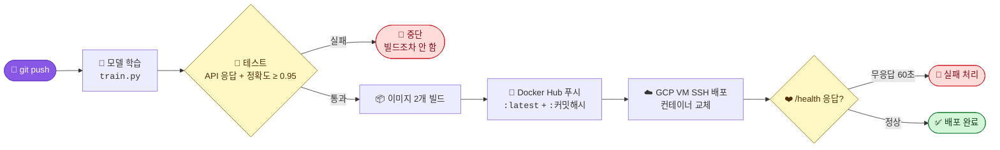
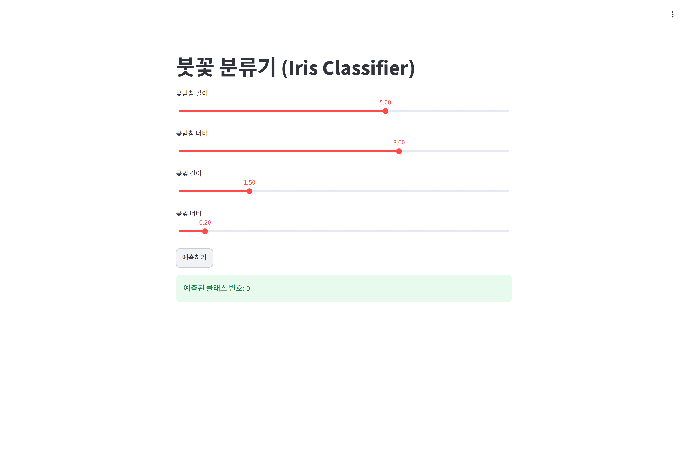
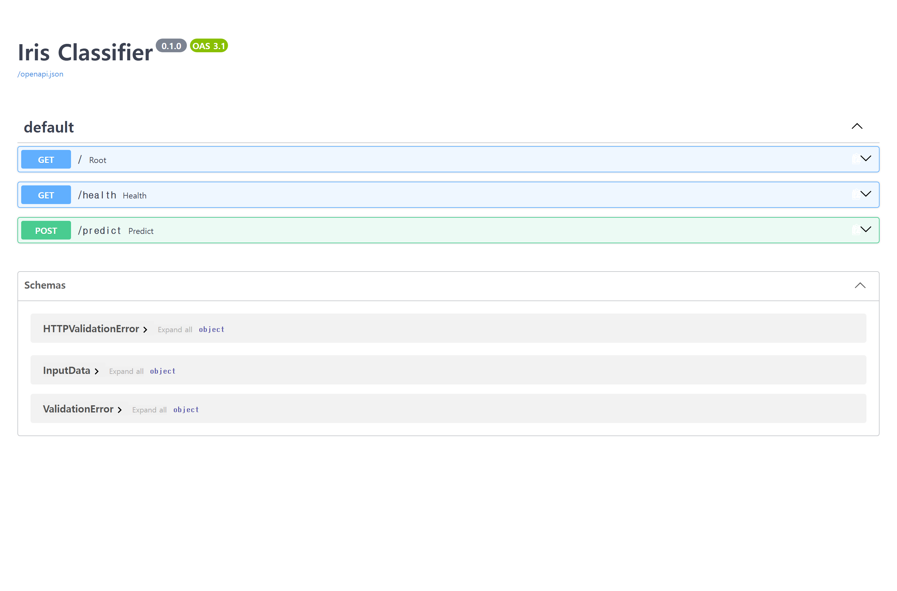
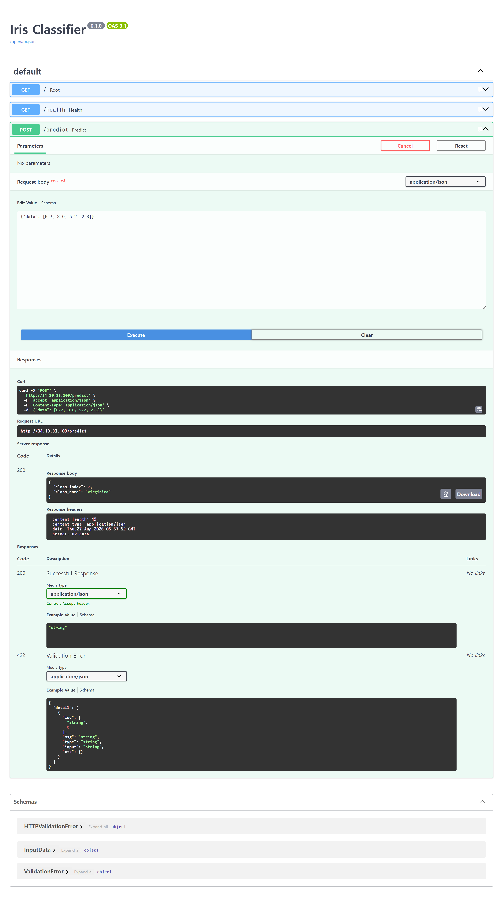
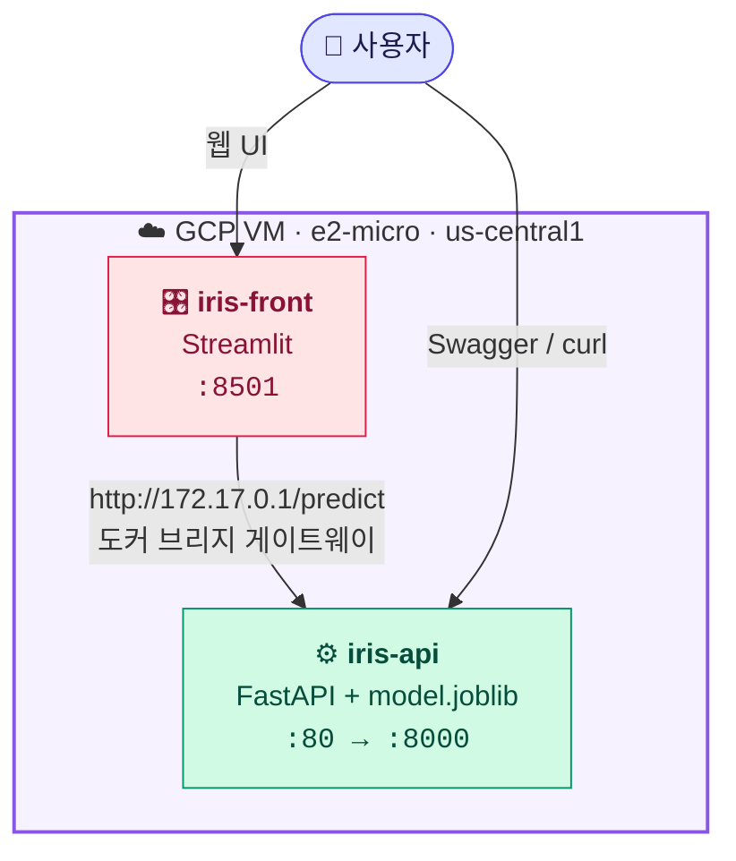
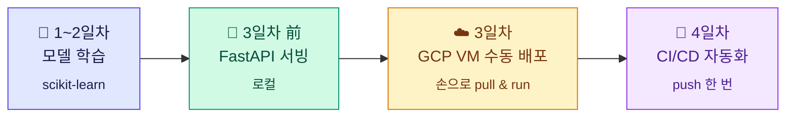

<div align="center">

<picture>
  <source media="(prefers-color-scheme: dark)" srcset="docs/assets/banner-dark.svg">
  <source media="(prefers-color-scheme: light)" srcset="docs/assets/banner-light.svg">
  
</picture>

<br><br>

[](https://github.com/soya914/mlops_serving/actions/workflows/main.yml)
[](https://hub.docker.com/r/soya14/iris-classifier)
[](https://github.com/soya914/mlops_serving/commits/main)
[](https://github.com/soya914/mlops_serving)


### `git push` 한 번이면 — 학습부터 GCP 배포, 응답 확인까지 사람 손이 닿지 않습니다


</div>

## ⚡ 파이프라인



> **핵심은 "깨지면 앞에서 멈춘다"입니다.**
> 정확도가 떨어진 모델도, 빌드가 깨진 이미지도 운영 서버까지 흘러가지 못합니다.

| 단계 | Job | 하는 일 | 실패하면 |
|:--:|:---|:---|:---|
| 1️⃣ | `train-and-test` | 모델 학습 → API 응답 테스트 → 정확도 게이트 | 빌드 안 함 |
| 2️⃣ | `build-and-push` | 이미지 2개 빌드 → Docker Hub 푸시 | 배포 안 함 |
| 3️⃣ | `deploy` | VM SSH → pull → 컨테이너 교체 → `/health` 확인 | 워크플로 🔴 |

학습된 `model.joblib` 은 artifact 로 다음 job 에 전달됩니다.
따라서 **배포된 이미지 속 모델 = 방금 테스트를 통과한 바로 그 모델** 입니다.

<div align="center"></div>

## 📸 미리보기

<table>
  <tr>
    <td width="50%" align="center">
      <br>
      <sub><b>🎛️ Streamlit — 슬라이더로 꽃 치수 입력</b></sub>
    </td>
    <td width="50%" align="center">
      <br>
      <sub><b>🌸 예측 결과</b></sub>
    </td>
  </tr>
  <tr>
    <td width="50%" align="center">
      <br>
      <sub><b>📘 FastAPI Swagger 문서</b></sub>
    </td>
    <td width="50%" align="center">
      <br>
      <sub><b>⚡ POST /predict 200 OK</b></sub>
    </td>
  </tr>
</table>

<div align="center"></div>

## 🏗️ 아키텍처

무료 등급 e2-micro **한 대** 안에서 컨테이너 두 개가 돕니다. 인스턴스를 늘리면 무료 등급을 벗어나기 때문입니다.



프론트엔드는 백엔드를 **외부 IP가 아니라 도커 브리지 게이트웨이**로 호출합니다.
VM을 껐다 켜서 외부 IP가 바뀌어도 내부 통신은 그대로 살아 있습니다.

<div align="center"></div>

## 🔌 API

베이스 URL: `http://<VM 외부 IP>` — ⚠️ **`https` 아닙니다**

| | 메서드 | 경로 | 설명 |
|:--:|:---|:---|:---|
| 🏠 | `GET` | `/` | 서버 생존 메시지 |
| ❤️ | `GET` | `/health` | `{"status": "ok"}` — CD 검증에 사용 |
| 📘 | `GET` | `/docs` | Swagger UI |
| 🔮 | `POST` | `/predict` | 붓꽃 품종 예측 |

```bash
curl -X POST http://<VM IP>/predict \
  -H "Content-Type: application/json" \
  -d '{"data":[6.7,3.0,5.2,2.3]}'
```

```json
{ "class_index": 2, "class_name": "virginica" }
```

<details>
<summary><b>📥 요청 형식과 예측 예시 펼쳐보기</b></summary>

<br>

`data` 는 실수 4개이며 순서가 정해져 있습니다.

| 순서 | 항목 | 단위 |
|:--:|:---|:---|
| 0 | 꽃받침 길이 (sepal length) | cm |
| 1 | 꽃받침 너비 (sepal width) | cm |
| 2 | 꽃잎 길이 (petal length) | cm |
| 3 | 꽃잎 너비 (petal width) | cm |

| 입력 | 응답 | 품종 |
|:---|:---|:---|
| `[5.1, 3.5, 1.4, 0.2]` | `{"class_index": 0, "class_name": "setosa"}` | 🌱 setosa |
| `[6.0, 2.7, 5.1, 1.6]` | `{"class_index": 1, "class_name": "versicolor"}` | 🌿 versicolor |
| `[6.7, 3.0, 5.2, 2.3]` | `{"class_index": 2, "class_name": "virginica"}` | 🌷 virginica |

</details>

<div align="center"></div>

## 🚀 로컬에서 돌려보기

```bash
pip install -r requirements.txt -r requirements-dev.txt
python train.py      # model.joblib 생성
pytest               # 테스트 5개
uvicorn main:app --reload
```

브라우저에서 `http://127.0.0.1:8000/docs` 로 접속하면 Swagger UI가 뜹니다.

<details>
<summary><b>🐳 도커로 띄우기</b></summary>

<br>

```bash
docker build -t iris-classifier .
docker run -d -p 8000:8000 iris-classifier
```

프론트엔드까지 같이 띄우려면:

```bash
docker build -f Dockerfile.frontend -t iris-frontend .
docker run -d -p 8501:8501 -e API_URL=http://host.docker.internal:8000/predict iris-frontend
```

</details>

<details>
<summary><b>🧪 테스트가 무엇을 막아주나</b></summary>

<br>

`tests/test_api.py` 는 5개입니다.

| 테스트 | 막아주는 사고 |
|:---|:---|
| `test_root`, `test_health` | 서버가 아예 안 뜨는 이미지 배포 |
| `test_predict_setosa` | 응답 스키마가 바뀌어 프론트가 깨지는 것 |
| `test_predict_virginica` | 클래스 매핑이 뒤섞이는 것 |
| `test_model_accuracy` | **정확도 0.95 미만 모델의 배포** |

</details>

<div align="center"></div>

## 🔐 필요한 시크릿 5개

`Settings → Secrets and variables → Actions`

| | 이름 | 값 |
|:--:|:---|:---|
| 🐳 | `DOCKERHUB_USERNAME` | Docker Hub 아이디 |
| 🔑 | `DOCKERHUB_TOKEN` | Docker Hub 액세스 토큰 — **Read & Write** |
| 🌐 | `GCP_VM_HOST` | VM 외부 IP |
| 👤 | `GCP_VM_USERNAME` | VM SSH 계정명 |
| 🗝️ | `GCP_SSH_KEY` | 배포용 SSH 개인키 전문 |

> [!WARNING]
> **VM을 껐다 켜면 외부 IP가 바뀝니다.** `GCP_VM_HOST` 가 옛날 IP를 가리키면 배포가 타임아웃으로 죽습니다.
> ```bash
> bash scripts/update-vm-host.sh
> ```
> 이 한 줄이 현재 IP를 읽어 시크릿을 갱신해 줍니다.

> [!CAUTION]
> `GCP_SSH_KEY` 는 서버 접속 권한 그 자체입니다. 채팅·문서·커밋 어디에도 남기지 마세요.
> `.gitignore` 에 `gcp_deploy_key*` 를 넣어 두었지만, 애초에 레포 폴더 밖에서 만드는 것이 안전합니다.

<div align="center"></div>

## 🗺️ 프로젝트 여정



3일차까지는 이미지를 만들고 VM에 들어가 `pull` 하고 `run` 하는 일을 **매번 손으로** 했습니다.
모델이 바뀔 때마다 반복되던 그 과정을 4일차에 전부 자동화했습니다.

<div align="center"></div>

## 📁 폴더 구조

```
mlops_serving/
├── 🤖 .github/workflows/main.yml   CI/CD 파이프라인 (3 jobs)
├── ⚙️  main.py                      FastAPI 서버
├── 🧠 train.py                     모델 학습
├── 🎛️  streamlit_app.py             프론트엔드
├── 💾 model.joblib                 학습된 모델 (CI가 매번 새로 생성)
├── 🐳 Dockerfile                   백엔드 이미지
├── 🐳 Dockerfile.frontend          프론트 이미지
├── 🧪 tests/test_api.py            API 응답 + 정확도 게이트
├── ⚙️  pytest.ini                   import 경로 고정
├── 🔧 scripts/update-vm-host.sh    VM IP 변경 시 시크릿 갱신
├── 📚 docs/
│   ├── DAY3.md                    GCP 수동 배포 기록 · 요금 관리
│   └── DAY4.md                    CI/CD 구축 · 트러블슈팅
└── 📸 captures/                    실행 결과 캡처
```

## 📚 문서

<table>
  <tr>
    <td width="50%">
      <h3>🤖 <a href="docs/DAY4.md">DAY4 — CI/CD 구축</a></h3>
      시크릿 설정, 강의 자료대로 하면 깨지는 지점 4가지, 실패 증상별 원인표
    </td>
    <td width="50%">
      <h3>☁️ <a href="docs/DAY3.md">DAY3 — GCP 수동 배포</a></h3>
      VM 생성, 방화벽, 컨테이너 2개 구성, 요금 관리와 재시작 절차
    </td>
  </tr>
</table>

## 🐳 이미지

| 이미지 | 역할 | 포트 |
|:---|:---|:---|
| [`soya14/iris-classifier`](https://hub.docker.com/r/soya14/iris-classifier) | FastAPI + 모델 | `80 → 8000` |
| [`soya14/iris-frontend`](https://hub.docker.com/r/soya14/iris-frontend) | Streamlit UI | `8501 → 8501` |

<br>

<div align="center">


<sub>🌸 Iris 데이터셋 · RandomForestClassifier · scikit-learn</sub>

</div>
