<div align="center">

<picture>
  <source media="(prefers-color-scheme: dark)" srcset="docs/assets/banner-dark.svg">
  <source media="(prefers-color-scheme: light)" srcset="docs/assets/banner-light.svg">
  
</picture>

<br><br>

[](https://github.com/soya914/mlops_serving/actions/workflows/main.yml)
[](https://hub.docker.com/r/soya14/iris-classifier)
[](https://github.com/soya914/mlops_serving/commits/main)
[](https://github.com/soya914/mlops_serving)


### `git push` 한 번이면 — 학습 · 검증 · 이미지 빌드 · GCP 배포 · 응답 확인까지 사람 손이 닿지 않습니다

<a href="#-파이프라인">파이프라인</a> ·
<a href="#-모델-선택-결과">모델 선택</a> ·
<a href="#-미리보기">미리보기</a> ·
<a href="#-아키텍처">아키텍처</a> ·
<a href="#-api">API</a> ·
<a href="#-로컬에서-돌려보기">로컬 실행</a> ·
<a href="#-설계-결정">설계 결정</a> ·
<a href="#-운영">운영</a>


</div>

## 📋 한눈에 보기

| | |
|:---|:---|
| **하는 일** | 붓꽃 치수 4개 → 품종 3종 분류 (setosa / versicolor / virginica) |
| **모델** | 후보 3개를 5-fold 교차검증으로 비교해 최고 성능 하나만 저장 |
| **서빙** | FastAPI (백엔드) + Streamlit (프론트엔드), 컨테이너 2개 |
| **배포 대상** | GCP Compute Engine `e2-micro` · `us-central1` · 무료 등급 |
| **자동화 범위** | `git push` → 학습 → 게이트 → 빌드 → 푸시 → 배포 → 외부 검증 |
| **품질 게이트** | 홀드아웃 정확도 ≥ 0.90, 교차검증 정확도 ≥ 0.93, 테스트 14개 |
| **이미지 태그** | `:latest` 와 `:커밋해시` 동시 발행, **배포는 커밋해시로** |

<div align="center"></div>

## ⚡ 파이프라인

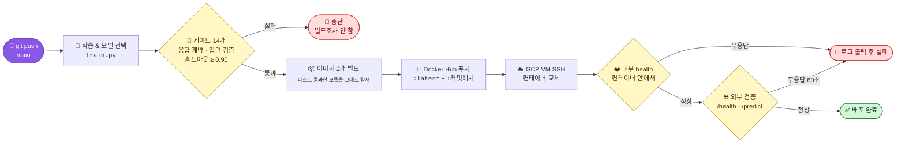

> **핵심은 "깨지면 그 앞에서 멈춘다" 입니다.**
> 성능이 떨어진 모델도, 빌드가 깨진 이미지도, 뜨지 않는 컨테이너도 초록불을 받지 못합니다.

<table>
<tr><th width="14%">단계</th><th width="24%">Job</th><th width="40%">하는 일</th><th width="22%">실패하면</th></tr>
<tr>
  <td align="center">1️⃣</td>
  <td><code>train-and-test</code></td>
  <td>후보 3개 교차검증 → 최고 모델 선택 → 홀드아웃 평가 → 테스트 14개</td>
  <td>빌드하지 않음</td>
</tr>
<tr>
  <td align="center">2️⃣</td>
  <td><code>build-and-push</code></td>
  <td>학습 산출물 수령 검증 → 이미지 2개 빌드 → Docker Hub 푸시</td>
  <td>배포하지 않음</td>
</tr>
<tr>
  <td align="center">3️⃣</td>
  <td><code>deploy</code></td>
  <td>VM SSH → pull → 컨테이너 교체 → 내부 health → 외부 <code>/predict</code></td>
  <td>워크플로 🔴</td>
</tr>
</table>

학습된 `model.joblib` 과 `metrics.json` 은 **artifact 로** 다음 job 에 전달됩니다.
레포에 커밋된 파일이 아니라 방금 만든 것이 이미지에 들어가므로,
**배포된 이미지 속 모델 = 게이트를 통과한 바로 그 모델** 입니다.

<details>
<summary><b>📊 Actions 실행 페이지에 뜨는 요약</b></summary>

<br>

각 job 이 `$GITHUB_STEP_SUMMARY` 에 결과를 씁니다. 로그를 펼치지 않아도 요약 화면에서 바로 보입니다.

| 표시되는 내용 | 어느 job |
|:---|:---|
| 선택된 모델, CV/홀드아웃 정확도, 후보 3개 비교표 | `train-and-test` |
| 푸시된 이미지와 태그 | `build-and-push` |
| `/health`, `/predict`, `/model-info` 실제 응답 | `deploy` |
| 실패 시 확인할 항목 체크리스트 | `deploy` (실패 시) |

</details>

<div align="center"></div>

## 📊 모델 선택 결과

아래 수치는 `train.py` 가 실제로 출력해 `metrics.json` 에 남긴 값입니다. 그림도 그 파일에서 생성됩니다.

<div align="center">
<picture>
  <source media="(prefers-color-scheme: dark)" srcset="docs/assets/metrics-dark.svg">
  <source media="(prefers-color-scheme: light)" srcset="docs/assets/metrics-light.svg">
  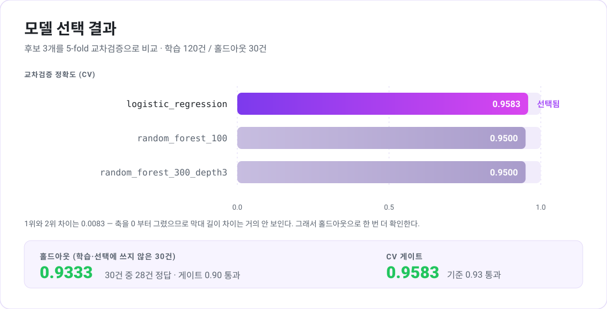
</picture>
</div>

RandomForest 두 개가 CV 0.9500 으로 동률이고, LogisticRegression 이 0.9583 으로 근소하게 앞섭니다.
차이가 0.0083 밖에 안 되므로 **CV 만으로 결론 내지 않고**, 학습에도 선택에도 쓰지 않은
홀드아웃 30건으로 한 번 더 채점합니다. 결과는 0.9333(28/30)으로 게이트 0.90 을 통과했습니다.

<div align="center"></div>

## 📸 미리보기

아래는 **이 레포의 현재 코드로 빌드한 이미지**를 실제로 띄워 찍은 화면입니다.
(3일차 캡처는 `:v1` 이미지라 `/model-info` 와 확률 필드가 없어 새로 찍었습니다.)

<table>
  <tr>
    <td width="50%" align="center" valign="top">
      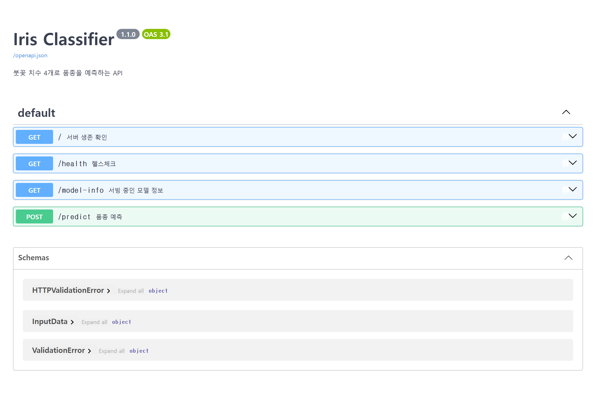<br>
      <sub><b>📘 Swagger UI</b> — 엔드포인트 4개, API v1.1.0</sub>
    </td>
    <td width="50%" align="center" valign="top">
      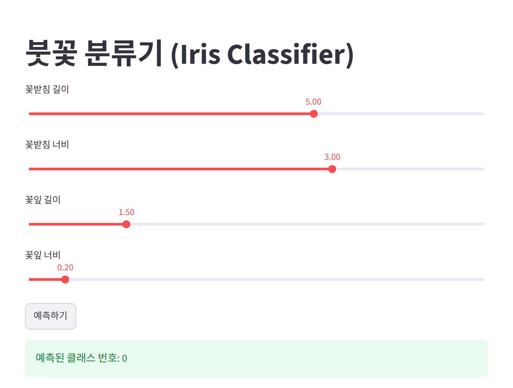<br>
      <sub><b>🎛️ Streamlit</b> — 슬라이더 입력 → 예측 결과</sub>
    </td>
  </tr>
  <tr>
    <td width="50%" align="center" valign="top">
      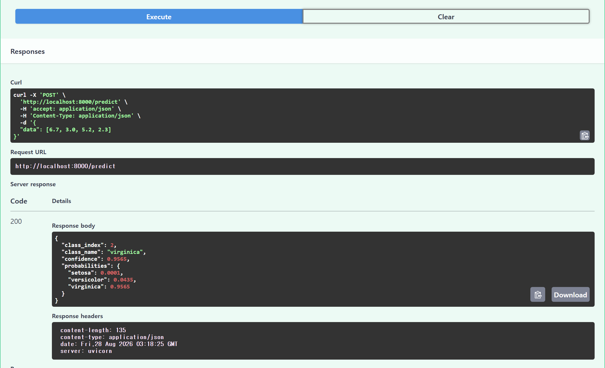<br>
      <sub><b>🔮 POST /predict</b> — <code>virginica</code>, confidence 0.9565, 확률 분포 포함</sub>
    </td>
    <td width="50%" align="center" valign="top">
      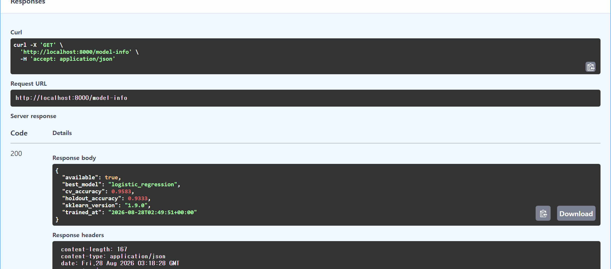<br>
      <sub><b>🧠 GET /model-info</b> — 서빙 중인 모델과 성능이 그대로 노출</sub>
    </td>
  </tr>
</table>

`/model-info` 응답의 `logistic_regression` · `0.9583` · `0.9333` 은 위 차트의 값과 같습니다.
**학습 → 이미지 → 서빙까지 같은 모델이 흘러간다**는 것을 이 화면으로 확인할 수 있습니다.

<details>
<summary><b>📷 3일차(수동 배포) 캡처도 보기</b></summary>

<br>

<table>
  <tr>
    <td width="50%" align="center">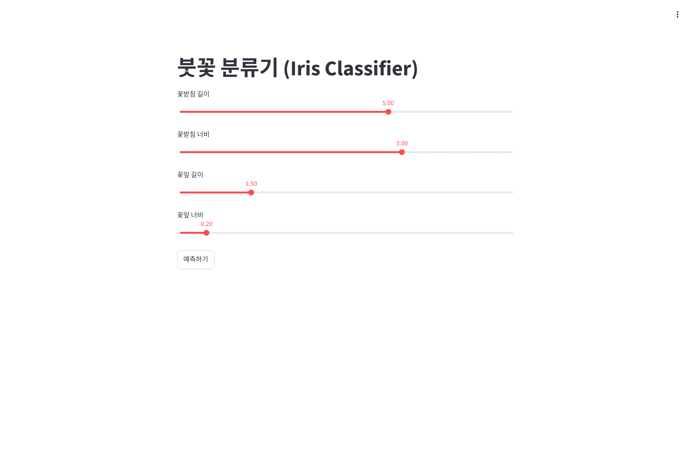<br><sub>3일차 Streamlit</sub></td>
    <td width="50%" align="center">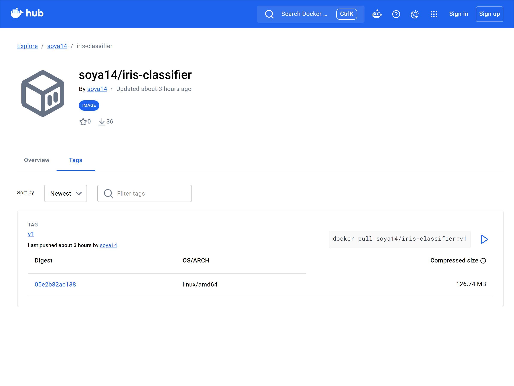<br><sub>Docker Hub 태그 페이지</sub></td>
  </tr>
</table>

캡처를 다시 만들려면 컨테이너를 띄운 뒤 `python captures/capture_v2.py` 를 실행합니다.

</details>

<div align="center"></div>

## 🏗 아키텍처

무료 등급 `e2-micro` **한 대** 안에서 컨테이너 두 개가 돕니다.
인스턴스를 늘리면 무료 등급(리전당 1대)을 벗어나기 때문입니다.

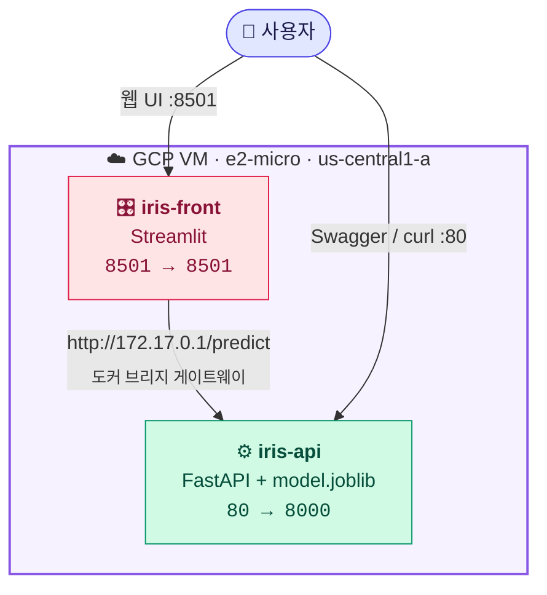

예측 요청 한 건이 흐르는 경로입니다.

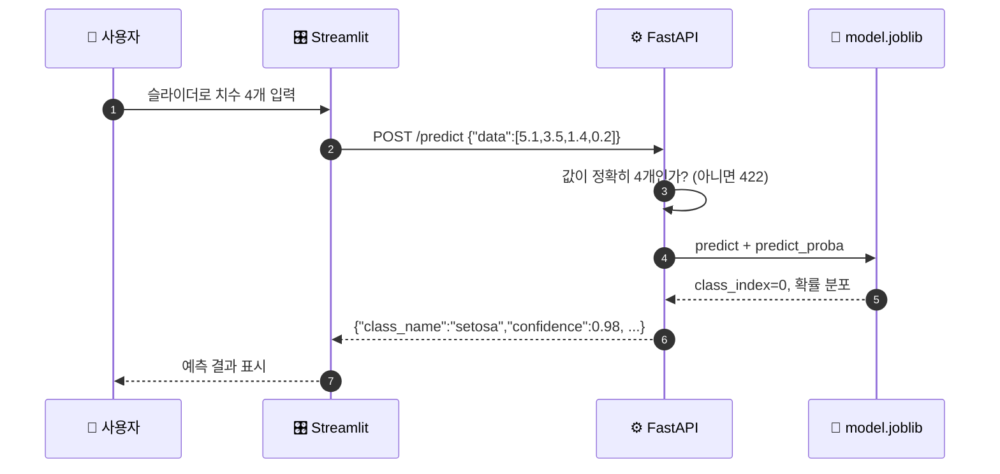

프론트엔드는 백엔드를 **외부 IP 가 아니라 도커 브리지 게이트웨이**(`172.17.0.1`)로 호출합니다.
VM 을 껐다 켜서 외부 IP 가 바뀌어도 내부 통신은 그대로 살아 있습니다.

<div align="center"></div>

## 🔌 API

베이스 URL: `http://<VM 외부 IP>` — ⚠️ **`https` 가 아닙니다** (TLS 미설정)

| | 메서드 | 경로 | 설명 |
|:--:|:---|:---|:---|
| 🏠 | `GET` | `/` | 서버 생존 메시지 + API 버전 |
| ❤️ | `GET` | `/health` | `{"status": "ok"}` — CD 검증이 사용 |
| 🧠 | `GET` | `/model-info` | 서빙 중인 모델 이름 · 정확도 · 학습 시각 |
| 📘 | `GET` | `/docs` | Swagger UI |
| 🔮 | `POST` | `/predict` | 품종 예측 (확률 포함) |

```bash
curl -X POST http://<VM IP>/predict \
  -H "Content-Type: application/json" \
  -d '{"data":[6.7,3.0,5.2,2.3]}'
```

```json
{
  "class_index": 2,
  "class_name": "virginica",
  "confidence": 0.9565,
  "probabilities": { "setosa": 0.0001, "versicolor": 0.0435, "virginica": 0.9565 }
}
```

<details>
<summary><b>📥 입력 형식 · 예측 예시 · 오류 응답</b></summary>

<br>

**`data` 는 실수 4개이며 순서가 고정입니다.**

| 순서 | 항목 | 단위 | 대략적 범위 |
|:--:|:---|:--:|:---|
| 0 | 꽃받침 길이 (sepal length) | cm | 4.3 ~ 7.9 |
| 1 | 꽃받침 너비 (sepal width) | cm | 2.0 ~ 4.4 |
| 2 | 꽃잎 길이 (petal length) | cm | 1.0 ~ 6.9 |
| 3 | 꽃잎 너비 (petal width) | cm | 0.1 ~ 2.5 |

**예측 예시**

| 입력 | `class_name` | `confidence` | |
|:---|:---|:--:|:--:|
| `[5.1, 3.5, 1.4, 0.2]` | `setosa` | 0.9808 | 🌱 |
| `[5.5, 2.4, 3.8, 1.1]` | `versicolor` | 0.9421 | 🌿 |
| `[6.7, 3.0, 5.2, 2.3]` | `virginica` | 0.9565 | 🌷 |
| `[6.0, 2.7, 5.1, 1.6]` | `virginica` | 0.5268 | ⚖️ 경계 샘플 |

마지막 행은 versicolor 와 virginica 사이의 유명한 경계 샘플입니다.
확률이 0.53 대 0.47 로 갈리므로, 이런 입력에서는 `confidence` 를 함께 보는 편이 좋습니다.

**오류 응답**

| 상황 | 상태 코드 |
|:---|:--:|
| `data` 개수가 4개가 아님 | `422` |
| `data` 필드 자체가 없음 | `422` |
| 숫자가 아닌 값 | `422` |

값 개수를 서버에서 미리 막지 않으면 scikit-learn 내부에서 터져 `500` 이 납니다.
Pydantic 검증기로 `422` 로 돌려주도록 해 두었습니다.

</details>

<details>
<summary><b>🧠 <code>/model-info</code> 응답 예시</b></summary>

<br>

```json
{
  "available": true,
  "best_model": "logistic_regression",
  "cv_accuracy": 0.9583,
  "holdout_accuracy": 0.9333,
  "sklearn_version": "1.9.0",
  "trained_at": "2026-08-28T02:49:51+00:00"
}
```

배포 후 **"지금 VM 에 올라간 게 정말 방금 학습한 모델인가"** 를 확인하는 용도입니다.
`metrics.json` 이 없어도 서비스는 정상 기동하며, 이 경우 `available: false` 를 돌려줍니다.

</details>

<div align="center"></div>

## 🚀 로컬에서 돌려보기

```bash
pip install -r requirements.txt -r requirements-dev.txt
python train.py      # model.joblib + metrics.json 생성
pytest               # 테스트 14개
uvicorn main:app --reload
```

`http://127.0.0.1:8000/docs` 로 접속하면 Swagger UI 가 뜹니다.

<details>
<summary><b>🧠 <code>train.py</code> 가 출력하는 것</b></summary>

<br>

```
후보 3개를 5-fold 교차검증으로 비교합니다.
학습 120건 / 홀드아웃 30건

  random_forest_100          CV 0.9500  (±0.0312)
  random_forest_300_depth3   CV 0.9500  (±0.0312)
  logistic_regression        CV 0.9583  (±0.0264)

선택된 모델: logistic_regression
  CV 정확도      0.9583
  홀드아웃 정확도 0.9333  ← 한 번도 안 본 데이터
```

홀드아웃 30건은 **학습에도 모델 선택에도 쓰지 않습니다.** 오직 마지막 채점에만 씁니다.

</details>

<details>
<summary><b>🐳 도커로 두 컨테이너 띄우기</b></summary>

<br>

프론트가 백엔드를 이름으로 찾을 수 있도록 사용자 정의 네트워크를 씁니다.
(`host.docker.internal` 은 리눅스에서 기본 동작하지 않습니다.)

```bash
docker network create iris-net

docker build -t iris-classifier -f Dockerfile .
docker build -t iris-frontend  -f Dockerfile.frontend .

docker run -d --name iris-api   --network iris-net -p 8000:8000 iris-classifier
docker run -d --name iris-front --network iris-net -p 8501:8501 \
  -e API_URL=http://iris-api:8000/predict iris-frontend
```

정리:

```bash
docker rm -f iris-api iris-front && docker network rm iris-net
```

</details>

<details>
<summary><b>🧪 테스트 14개가 각각 무엇을 막는가</b></summary>

<br>

| 테스트 | 막아주는 사고 |
|:---|:---|
| `test_root`, `test_health` | 아예 뜨지 않는 이미지의 배포 |
| `test_predict_setosa` | 응답 스키마가 바뀌어 프론트가 깨지는 것 |
| `test_predict_versicolor`, `test_predict_virginica` | 클래스 인덱스 ↔ 이름 매핑이 뒤섞이는 것 |
| `test_predict_returns_probabilities` | 확률 합이 1 이 아니거나 최대 확률과 예측이 어긋나는 것 |
| `test_wrong_feature_count_is_422` ×3 | 잘못된 입력이 `500` 으로 새는 것 |
| `test_missing_field_is_422` | 필드 누락 시 서버 오류 |
| `test_model_info_matches_metrics` | 이미지 속 모델과 메타데이터의 불일치 |
| `test_holdout_accuracy_gate` | **성능이 떨어진 모델의 배포** |
| `test_cv_accuracy_gate` | 교차검증 단계에서의 성능 저하 |
| `test_holdout_was_not_used_for_training` | 홀드아웃이 학습에 섞여 게이트가 무력화되는 것 |

</details>

<div align="center"></div>

## 🧭 설계 결정

왜 이렇게 만들었는지, 대안은 무엇이었는지 남겨 둡니다.

<table>
<tr><th width="30%">결정</th><th width="35%">이유</th><th width="35%">택하지 않은 것</th></tr>
<tr>
  <td><b>성능 게이트를 홀드아웃으로</b></td>
  <td>학습 데이터로 채점하면 RandomForest 는 거의 1.0 이 나와 게이트가 아무것도 막지 못한다</td>
  <td>전체 데이터 재채점 — 숫자는 예쁘지만 무의미</td>
</tr>
<tr>
  <td><b>배포는 커밋해시 태그로</b></td>
  <td><code>latest</code> 는 "언제 받은 latest 인지" 추적이 안 되고, 롤백 대상을 특정할 수 없다</td>
  <td><code>latest</code> 단독 — 편하지만 어떤 코드가 도는지 모름</td>
</tr>
<tr>
  <td><b>컨테이너를 포트로도 제거</b></td>
  <td>3일차에 <code>--name</code> 없이 띄운 컨테이너는 이름으로 안 지워지고 포트만 물고 있다</td>
  <td>이름으로만 제거 — <code>port is already allocated</code> 로 실패</td>
</tr>
<tr>
  <td><b>프론트 → 백엔드는 내부 주소</b></td>
  <td>외부 IP 는 VM 재시작마다 바뀐다. 브리지 게이트웨이는 안 바뀐다</td>
  <td>외부 IP 하드코딩 — 재시작 때마다 프론트가 깨짐</td>
</tr>
<tr>
  <td><b>VM 한 대에 컨테이너 두 개</b></td>
  <td>인스턴스를 늘리면 무료 등급(리전당 e2-micro 1대)을 벗어난다</td>
  <td>서비스별 VM 분리 — 정석이지만 유료</td>
</tr>
<tr>
  <td><b><code>pytest.ini</code> 로 import 경로 고정</b></td>
  <td>로컬 <code>python -m pytest</code> 는 통과하는데 CI 의 <code>pytest</code> 가 죽는 사고를 방지</td>
  <td>실행 방식에 의존 — 환경 따라 결과가 달라짐</td>
</tr>
<tr>
  <td><b>배포 동시 실행을 큐잉</b></td>
  <td>컨테이너 교체 중에 또 교체가 들어오면 서비스가 어중간한 상태로 남는다</td>
  <td><code>cancel-in-progress</code> — 배포가 중간에 끊길 수 있음</td>
</tr>
</table>

<div align="center"></div>

## 🔐 운영

### 필요한 시크릿 5개

`Settings → Secrets and variables → Actions`

| | 이름 | 값 | 어디서 |
|:--:|:---|:---|:---|
| 🐳 | `DOCKERHUB_USERNAME` | Docker Hub 아이디 | Docker Hub 프로필 |
| 🔑 | `DOCKERHUB_TOKEN` | 액세스 토큰 — **Read & Write** | Account settings → Personal access tokens |
| 🌐 | `GCP_VM_HOST` | VM 외부 IP | `gcloud compute instances list` |
| 👤 | `GCP_VM_USERNAME` | VM SSH 계정명 | VM 안에서 `whoami` |
| 🗝️ | `GCP_SSH_KEY` | 배포용 SSH 개인키 **전문** | `ssh-keygen` 후 공개키를 VM 메타데이터에 등록 |

> [!WARNING]
> **VM 을 껐다 켜면 외부 IP 가 바뀝니다.** `GCP_VM_HOST` 가 옛 IP 를 가리키면 배포가 타임아웃으로 죽습니다.
> ```bash
> bash scripts/update-vm-host.sh
> ```
> 현재 IP 를 읽어 시크릿을 갱신해 줍니다. 고정 IP 를 예약하면 이 문제는 사라지지만,
> **VM 이 꺼져 있어도 계속 과금**되므로 수업용으로는 이 스크립트 쪽이 저렴합니다.

> [!CAUTION]
> `GCP_SSH_KEY` 는 서버 접속 권한 그 자체입니다. 채팅 · 문서 · 커밋 어디에도 남기지 마세요.
> `.gitignore` 에 `gcp_deploy_key*` 를 넣어 두었지만, 애초에 레포 폴더 **밖에서** 만드는 것이 안전합니다.

### 자주 쓰는 명령

```bash
gcloud compute instances start  iris-vm --zone=us-central1-a   # 켜기
gcloud compute instances stop   iris-vm --zone=us-central1-a   # 끄기 (IP 요금 정지)
bash scripts/update-vm-host.sh                                  # 바뀐 IP 를 시크릿에 반영
git commit --allow-empty -m "redeploy" && git push              # 코드 변경 없이 재배포
```

### 실패 증상별 원인

| 증상 | 원인 |
|:---|:---|
| `failed to read dockerfile` | 워크플로의 `file:` 경로 대소문자 (`Dockerfile`) |
| `unauthorized: incorrect username or password` | `DOCKERHUB_TOKEN` 이 비밀번호이거나 권한이 Read only |
| `ssh: handshake failed` | 공개키가 VM 에 미등록 / `GCP_VM_USERNAME` 오타 |
| `dial tcp ...: i/o timeout` | VM 이 꺼져 있거나 **IP 가 바뀜** |
| `error parsing private key` | 개인키 복사 시 BEGIN/END 줄 또는 줄바꿈 누락 |
| `port is already allocated` | 옛 컨테이너가 포트를 물고 있음 |
| `ModuleNotFoundError: No module named 'main'` | `pytest.ini` 의 `pythonpath` 누락 |
| health check 실패 | 방화벽 `tcp:80` / 컨테이너 기동 실패 → `sudo docker logs iris-api` |

자세한 내용은 [docs/DAY4.md](docs/DAY4.md) 에 있습니다.

<div align="center"></div>

## 🗺 프로젝트 여정

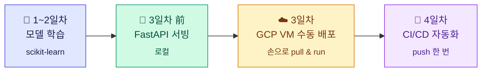

3일차까지는 이미지를 만들고 VM 에 들어가 `pull` 하고 `run` 하는 일을 **매번 손으로** 했습니다.
모델이 바뀔 때마다 반복되던 그 과정을 4일차에 전부 자동화했습니다.

<div align="center"></div>

## 📁 폴더 구조

```
mlops_serving/
├── 🤖 .github/workflows/main.yml   CI/CD 파이프라인 (3 jobs)
├── ⚙️  main.py                      FastAPI 서버 (/predict, /model-info)
├── 🧠 train.py                     후보 비교 → 최고 모델 저장
├── 🎛️  streamlit_app.py             프론트엔드
├── 💾 model.joblib                 학습된 모델 (CI 가 매번 새로 생성)
├── 📊 metrics.json                 선택 근거와 성능 (게이트 · /model-info 가 읽음)
├── 🐳 Dockerfile                   백엔드 이미지
├── 🐳 Dockerfile.frontend          프론트 이미지
├── 🧪 tests/test_api.py            테스트 14개 (계약 · 검증 · 성능 게이트)
├── ⚙️  pytest.ini                   import 경로 고정
├── 🔧 scripts/update-vm-host.sh    VM IP 변경 시 시크릿 갱신
├── 📚 docs/
│   ├── DAY3.md                    GCP 수동 배포 기록 · 요금 관리
│   ├── DAY4.md                    CI/CD 구축 · 트러블슈팅
│   └── assets/                    배너 · 구분선 SVG
└── 📸 captures/                    실행 결과 캡처
```

## 📚 문서

<table>
  <tr>
    <td width="50%" valign="top">
      <h3>🤖 <a href="docs/DAY4.md">DAY4 — CI/CD 구축</a></h3>
      시크릿 설정, 강의 자료대로 하면 깨지는 지점, 실패 증상별 원인표
    </td>
    <td width="50%" valign="top">
      <h3>☁️ <a href="docs/DAY3.md">DAY3 — GCP 수동 배포</a></h3>
      VM 생성, 방화벽, 컨테이너 2개 구성, 요금 관리와 재시작 절차
    </td>
  </tr>
</table>

## 🐳 이미지

| 이미지 | 역할 | 포트 | 태그 |
|:---|:---|:---|:---|
| [`soya14/iris-classifier`](https://hub.docker.com/r/soya14/iris-classifier) | FastAPI + 모델 | `80 → 8000` | `latest`, `<커밋해시>` |
| [`soya14/iris-frontend`](https://hub.docker.com/r/soya14/iris-frontend) | Streamlit UI | `8501 → 8501` | `latest`, `<커밋해시>` |

<br>

<div align="center">


<sub>🌸 Iris 데이터셋 · scikit-learn · FastAPI · Docker · GitHub Actions · Google Cloud</sub>

</div>
